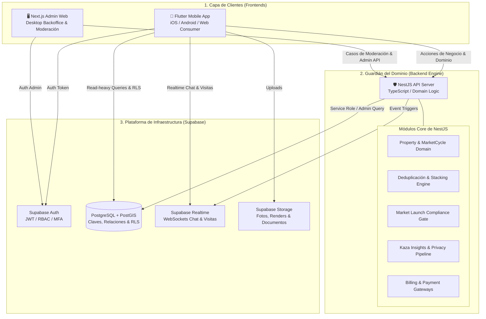

# 🏢 Kaza - Análisis de Viabilidad Técnica y Arquitectura de Referencia
> **Documento Evaluado:** `KAZA_Product_Architecture_Master_v0.2.docx`  
> **Stack Oficial del Sistema:**  
> 📱 **Flutter** (Mobile Cross-Platform Consumer & Professional App)  
> 🛡️ **NestJS / TypeScript** (Backend Server & Guardián del Dominio)  
> ⚡ **Supabase Platform** (PostgreSQL + PostGIS + Auth + Realtime + Storage)  
> 🖥️ **Next.js / TypeScript** (Backoffice Web Admin Desktop-First)  
> **Veredicto Técnico:** 🚀 **EXCELENCIA ARQUITECTÓNICA (10 / 10)** — Separación de responsabilidades de nivel empresarial.

---

## 📌 1. Visión y Separación de Responsabilidades

La arquitectura de Kaza consolida una separación clara entre la infraestructura de datos y la protección del dominio de negocio:



---

## 📊 2. Cuadro de Responsabilidades por Capa

| Capa del Stack | Tecnología | Responsabilidad Principal |
| :--- | :--- | :--- |
| **App Móvil / Frontend** | **Flutter** | Experiencia *map-first* táctil fluida, búsqueda por polígonos, previsualización de propiedades, 5 pestañas de navegación y compras In-App (Apple/Google IAP). |
| **Guardián del Dominio** | **NestJS (TypeScript)** | **Guardián de las Reglas de Negocio:** Valida transiciones de estado (`ListingStatus`, `ReservationRecord`), ejecuta la deduplicación de activos, valida los `Market Launch Compliance Gates`, procesa pasarelas externas para `Kaza Media` y pipeline de `Kaza Insights`. |
| **Plataforma de Infraestructura** | **Supabase** | **Persistencia & Servicios Base:** PostgreSQL relacional + extensión espacial **PostGIS**, autenticación JWT, WebSockets en tiempo real para chat/visitas y almacenamiento S3 para archivos multimediales. |
| **Backoffice de Administración** | **Next.js (TypeScript)** | Consola administrativa Web *Desktop-first* para moderación de contenido, gestión de `AdminCase`, verificación de identidad (*Trust*), configuración de mercados (*Country Market Config*) y auditoría. |

---

## 🏗️ 3. Estructura del Monorepo Kaza

```text
proyectoKaza/
  ├── mobile/             # 📱 App en Flutter (Navegación 5-Tabs, Mapa Map-First)
  ├── backend/            # 🛡️ Server NestJS (Guardián del Dominio & API Business Rules)
  ├── admin/              # 🖥️ App Web Next.js (Backoffice de Moderación & AdminCases)
  └── supabase/           # ⚡ Migraciones SQL PostgreSQL + PostGIS & Políticas RLS
```

---

## 💾 4. Esquema SQL (Supabase PostgreSQL + PostGIS)

El motor PostgreSQL de Supabase mantiene la integridad relacional de `Property` (permanente), `MarketCycle` (comercial) y `Listing` (publicación por controller):

```sql
CREATE EXTENSION IF NOT EXISTS postgis;
CREATE EXTENSION IF NOT EXISTS "uuid-ossp";

-- PROPERTIES (Activo Físico Permanente)
CREATE TABLE public.properties (
    id UUID PRIMARY KEY DEFAULT uuid_generate_v4(),
    canonical_location GEOMETRY(Point, 4326) NOT NULL,
    public_location GEOMETRY(Point, 4326) NOT NULL,
    country_code VARCHAR(3) NOT NULL,
    city_id VARCHAR(50) NOT NULL,
    property_type VARCHAR(50) NOT NULL,
    total_surface_m2 NUMERIC(10,2),
    created_at TIMESTAMPTZ NOT NULL DEFAULT NOW()
);

-- MARKET CYCLES (Episodio Comercial)
CREATE TABLE public.market_cycles (
    id UUID PRIMARY KEY DEFAULT uuid_generate_v4(),
    property_id UUID NOT NULL REFERENCES public.properties(id) ON DELETE CASCADE,
    operation_type VARCHAR(20) NOT NULL,
    status VARCHAR(20) NOT NULL DEFAULT 'OPEN',
    created_at TIMESTAMPTZ NOT NULL DEFAULT NOW()
);

-- LISTINGS (Publicación Comercial)
CREATE TABLE public.listings (
    id UUID PRIMARY KEY DEFAULT uuid_generate_v4(),
    property_id UUID NOT NULL REFERENCES public.properties(id),
    market_cycle_id UUID NOT NULL REFERENCES public.market_cycles(id),
    workspace_id UUID NOT NULL,
    controller_user_id UUID NOT NULL REFERENCES auth.users(id),
    title VARCHAR(255) NOT NULL,
    price_original NUMERIC(14,2),
    currency_original VARCHAR(3) DEFAULT 'USD',
    status VARCHAR(20) NOT NULL DEFAULT 'DRAFT',
    created_at TIMESTAMPTZ NOT NULL DEFAULT NOW()
);
```

---

## 🚀 5. Ventajas Estratégicas de esta Arquitectura

1. **NestJS como Guardián del Dominio:** Evita acoplar la lógica compleja del negocio inmobiliario a la base de datos o al cliente. NestJS centraliza las reglas del Master v0.2 (linaje de `Property`, `TransactionClaim`, no reiniciar DOM al transferir controller, etc.).
2. **Supabase como Acelerador de Infraestructura:** Elimina la necesidad de programar servidores de autenticación, almacenamiento de imágenes o infraestructura de WebSockets desde cero.
3. **Flutter como Front Único:** Permite rendimiento táctil cercano al nativo de 60-120 FPS para el renderizado geoespacial del mapa.
4. **Next.js para el Backoffice:** Framework idóneo para paneles administrativos web con renderizado rápido en servidor (SSR), dashboards con gráficos y gestión de auditoría `AdminCase`.

---

## 🗂️ DEV11-E · Estados Representativos del Sistema

> **Estados representativos del sistema para asegurar claridad, confianza y recuperación.**

| 🎯 Claridad | ✅ Confianza | 🎛️ Control | 🔄 Recuperación | ♿ Accesibilidad |
|:---|:---|:---|:---|:---|
| Estados predecibles | Mensajes honestos | Acciones claras | Siempre posible | WCAG 2.2 AA |

---

### Estados de la Interfaz

| # | Estado | Descripción |
|:--|:---|:---|
| **01** | ⏳ **Loading** | El sistema está cargando contenido. |
| **02** | 🔍 **Empty** | No hay resultados para la búsqueda. |
| **03** | ⚠️ **Error** | Ocurrió un error inesperado. |
| **04** | 🔒 **Restricted** | El contenido está restringido por políticas o región. |
| **05** | 📍 **Permission Required** | Se requiere un permiso del dispositivo. |
| **06** | ⭐ **Entitlement Required** | Se requiere un plan o permiso (no es tu rol). |
| **07** | 📡 **Offline** | No hay conexión a internet. |
| **08** | 📋 **Partial Data** | La información está incompleta. |
| **09** | ❓ **Unknown** | La información no está disponible. |
| **10** | ✅ **Confirmation Required** | Acción sensible que requiere confirmación. |
| **11** | 🎉 **Backend Success** | Acción completada correctamente. |
| **12** | 🔗 **Deep Link Reauthorization** | El enlace requiere revalidación. |

---

### 📱 Detalle de cada Estado

#### 01 · Loading
**Cargando KAZA** — Preparando el mapa…

#### 02 · Empty
> *No encontramos propiedades — Intenta ajustar los filtros o ampliar la búsqueda.*

Acciones: **Ajustar filtros** · Iniciar búsqueda

#### 03 · Error
> *Algo salió mal — No pudimos cargar la información. Inténtalo nuevamente.*

Acciones: **Solucionar** · Si el sitio…

#### 04 · Restricted
> *Contenido no disponible — Este contenido no está disponible en tu zona o región.*

Acciones: **Explorar otras zonas** · Más información

#### 05 · Permission Required
> *Necesitamos tu ubicación — Para mostrarte propiedades cercanas activa el permiso de ubicación.*

Acciones: **Ir a Configuración** · Ahora no

#### 06 · Entitlement Required
> *Función exclusiva — Esta función está disponible para usuarios Plus, Pro o Business.*

Acciones: **Ver planes** · Más información

#### 07 · Offline
> *Sin conexión — Verifica tu conexión a internet e intenta nuevamente.*

Acciones: **Solucionar** · Ver contenido guardado

#### 08 · Partial Data
> *Información parcial — Mostramos información con datos incompletos.*
>
> ⚠️ *Actualizado hace 7 días — Algunos números pueden variar.*

Acciones: **Actualizar datos**

#### 09 · Unknown
> *Información no disponible — Aún no tenemos datos para esta propiedad o zona.*

Acciones: **Explorar otras zonas**

#### 10 · Confirmation Required
> **Departamento de Budapest** — *¿Estás seguro? Vas a eliminar esta publicación. Esta acción no se puede deshacer.*

Acciones: **Sí, eliminar** · Cancelar

#### 11 · Backend Success
> *¡Listo! — Tu publicación fue publicada correctamente.*

Acciones: **Ver publicación** · Compartir

#### 12 · Deep Link Reauthorization
> *Revalidando acceso — Estamos verificando tu acceso a este contenido.*

---

### 🔣 Iconografía de Estados

| Ícono | Tipo |
|:---:|:---|
| ℹ️ | Información |
| ✅ | Éxito |
| ⚠️ | Advertencia |
| ❌ | Error |
| 🔒 | Bloqueo |
| ❓ | Desconocido |

---

### 🗣️ Tono de Mensajes

- ✅ Honesto y transparente
- ✅ Sin culpa, sin alarmismo
- ✅ Informa el problema y la solución
- ✅ Respeta el tiempo del usuario
- ✅ Siempre orientado a la acción

---

### 📏 Reglas Clave

- ❌ Nunca ocultar errores
- ❌ Nunca dejar pantallas en blanco
- ❌ Nunca confundir *Loading* con *Rol*
- ❌ Los estados no deben parecer promociones
- ❌ No usar dark patterns

---

### ⚠️ Nota Importante

> Los estados son parte del **producto**, no excepciones ni experiencias.
> Diseñados para generar **confianza** en cada situación.

---

*DEV11-E · Representative States · v0.1 — Parte del Prototipo KAZA · P03*
