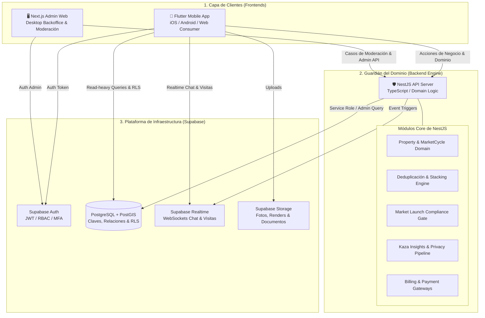

# 🏢 Kaza - Análisis de Viabilidad Técnica y Arquitectura de Referencia
> **Documento Evaluado:** `KAZA_Product_Architecture_Master_v0.2.docx`  
> **Stack Oficial del Sistema:**  
> 📱 **Flutter** (Mobile Cross-Platform Consumer & Professional App)  
> 🛡️ **NestJS / TypeScript** (Backend Server & Guardián del Dominio)  
> ⚡ **Supabase Platform** (PostgreSQL + PostGIS + Auth + Realtime + Storage)  
> 🖥️ **Next.js / TypeScript** (Backoffice Web Admin Desktop-First)  
> **Veredicto Técnico:** 🚀 **EXCELENCIA ARQUITECTÓNICA (10 / 10)** — Separación de responsabilidades de nivel empresarial.

---

## 📌 1. Visión y Separación de Responsabilidades

La arquitectura de Kaza consolida una separación clara entre la infraestructura de datos y la protección del dominio de negocio:



---

## 📊 2. Cuadro de Responsabilidades por Capa

| Capa del Stack | Tecnología | Responsabilidad Principal |
| :--- | :--- | :--- |
| **App Móvil / Frontend** | **Flutter** | Experiencia *map-first* táctil fluida, búsqueda por polígonos, previsualización de propiedades, 5 pestañas de navegación y compras In-App (Apple/Google IAP). |
| **Guardián del Dominio** | **NestJS (TypeScript)** | **Guardián de las Reglas de Negocio:** Valida transiciones de estado (`ListingStatus`, `ReservationRecord`), ejecuta la deduplicación de activos, valida los `Market Launch Compliance Gates`, procesa pasarelas externas para `Kaza Media` y pipeline de `Kaza Insights`. |
| **Plataforma de Infraestructura** | **Supabase** | **Persistencia & Servicios Base:** PostgreSQL relacional + extensión espacial **PostGIS**, autenticación JWT, WebSockets en tiempo real para chat/visitas y almacenamiento S3 para archivos multimediales. |
| **Backoffice de Administración** | **Next.js (TypeScript)** | Consola administrativa Web *Desktop-first* para moderación de contenido, gestión de `AdminCase`, verificación de identidad (*Trust*), configuración de mercados (*Country Market Config*) y auditoría. |

---

## 🏗️ 3. Estructura del Monorepo Kaza

```text
proyectoKaza/
  ├── mobile/             # 📱 App en Flutter (Navegación 5-Tabs, Mapa Map-First)
  ├── backend/            # 🛡️ Server NestJS (Guardián del Dominio & API Business Rules)
  ├── admin/              # 🖥️ App Web Next.js (Backoffice de Moderación & AdminCases)
  └── supabase/           # ⚡ Migraciones SQL PostgreSQL + PostGIS & Políticas RLS
```

---

## 💾 4. Esquema SQL (Supabase PostgreSQL + PostGIS)

El motor PostgreSQL de Supabase mantiene la integridad relacional de `Property` (permanente), `MarketCycle` (comercial) y `Listing` (publicación por controller):

```sql
CREATE EXTENSION IF NOT EXISTS postgis;
CREATE EXTENSION IF NOT EXISTS "uuid-ossp";

-- PROPERTIES (Activo Físico Permanente)
CREATE TABLE public.properties (
    id UUID PRIMARY KEY DEFAULT uuid_generate_v4(),
    canonical_location GEOMETRY(Point, 4326) NOT NULL,
    public_location GEOMETRY(Point, 4326) NOT NULL,
    country_code VARCHAR(3) NOT NULL,
    city_id VARCHAR(50) NOT NULL,
    property_type VARCHAR(50) NOT NULL,
    total_surface_m2 NUMERIC(10,2),
    created_at TIMESTAMPTZ NOT NULL DEFAULT NOW()
);

-- MARKET CYCLES (Episodio Comercial)
CREATE TABLE public.market_cycles (
    id UUID PRIMARY KEY DEFAULT uuid_generate_v4(),
    property_id UUID NOT NULL REFERENCES public.properties(id) ON DELETE CASCADE,
    operation_type VARCHAR(20) NOT NULL,
    status VARCHAR(20) NOT NULL DEFAULT 'OPEN',
    created_at TIMESTAMPTZ NOT NULL DEFAULT NOW()
);

-- LISTINGS (Publicación Comercial)
CREATE TABLE public.listings (
    id UUID PRIMARY KEY DEFAULT uuid_generate_v4(),
    property_id UUID NOT NULL REFERENCES public.properties(id),
    market_cycle_id UUID NOT NULL REFERENCES public.market_cycles(id),
    workspace_id UUID NOT NULL,
    controller_user_id UUID NOT NULL REFERENCES auth.users(id),
    title VARCHAR(255) NOT NULL,
    price_original NUMERIC(14,2),
    currency_original VARCHAR(3) DEFAULT 'USD',
    status VARCHAR(20) NOT NULL DEFAULT 'DRAFT',
    created_at TIMESTAMPTZ NOT NULL DEFAULT NOW()
);
```

---

## 🚀 5. Ventajas Estratégicas de esta Arquitectura

1. **NestJS como Guardián del Dominio:** Evita acoplar la lógica compleja del negocio inmobiliario a la base de datos o al cliente. NestJS centraliza las reglas del Master v0.2 (linaje de `Property`, `TransactionClaim`, no reiniciar DOM al transferir controller, etc.).
2. **Supabase como Acelerador de Infraestructura:** Elimina la necesidad de programar servidores de autenticación, almacenamiento de imágenes o infraestructura de WebSockets desde cero.
3. **Flutter como Front Único:** Permite rendimiento táctil cercano al nativo de 60-120 FPS para el renderizado geoespacial del mapa.
4. **Next.js para el Backoffice:** Framework idóneo para paneles administrativos web con renderizado rápido en servidor (SSR), dashboards con gráficos y gestión de auditoría `AdminCase`.
