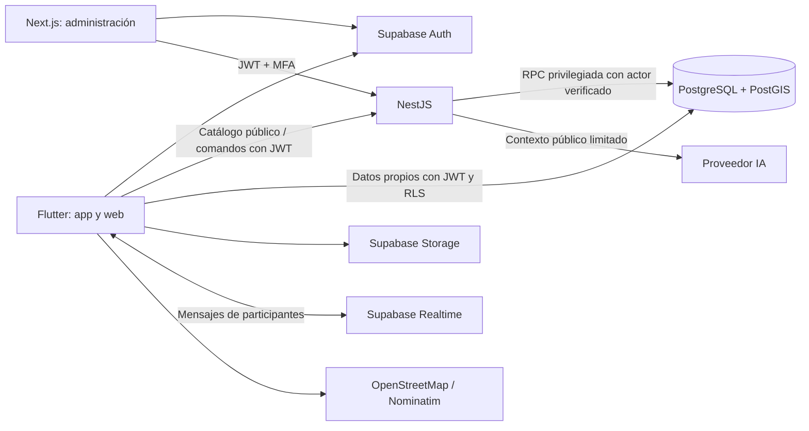
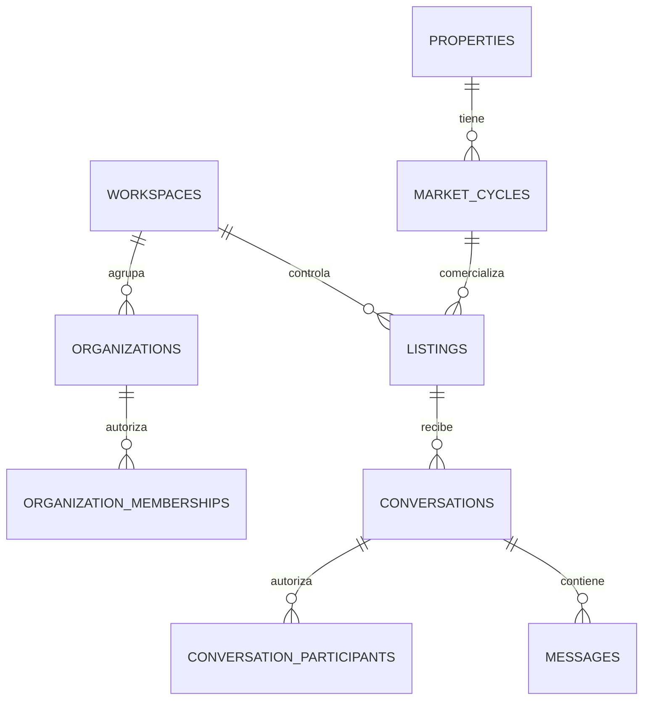

# KAZA — Arquitectura del proyecto

KAZA es una plataforma inmobiliaria con búsqueda por mapa, publicación de inmuebles, conversaciones, herramientas para agentes y organizaciones, proyectos de desarrolladoras y funciones financieras de demostración.

Actualizado el **27 de septiembre de 2026**. Este README describe el código local actual. Las migraciones y los despliegues remotos requieren la carga manual y verificación del propietario del proyecto. Algunas pantallas siguen siendo prototipos; su presencia no acredita un flujo productivo completo.

## Vista general


```mermaid
flowchart LR
    F[Flutter: app y web] --> A[Supabase Auth]
    N[Next.js: administración] --> A
    F -->|Catálogo público / comandos con JWT| API[NestJS]
    N -->|JWT + MFA| API
    API -->|RPC privilegiada con actor verificado| DB[(PostgreSQL + PostGIS)]
    F -->|Datos propios con JWT y RLS| DB
    F --> S[Supabase Storage]
    F <-->|Mensajes de participantes| RT[Supabase Realtime]
    API -->|Contexto público limitado| AI[Proveedor IA]
    F --> M[OpenStreetMap / Nominatim]
```

NestJS es un monolito modular. Centraliza publicación, estados, transferencia, organizaciones, mensajería, moderación e IA. Supabase directo se conserva para Auth, datos propios protegidos por RLS, favoritos, borradores y carga de imágenes. No hay microservicios ni procesos de colas activos; `pg-boss` sigue siendo una dependencia sin worker configurado.

## Repositorio y runtimes

| Carpeta | Stack | Responsabilidad |
| --- | --- | --- |
| `mobile/` | Flutter 3.27.0, Dart 3.6.0, Riverpod, GoRouter, flutter_map | Experiencia móvil/web y estado de interfaz. |
| `backend/` | NestJS 10, TypeScript, Node 22 | HTTP, validación, autenticación y coordinación de comandos. |
| `admin/` | Next.js 14, React 18 | Login administrativo, MFA, catálogo de soporte y moderación. |
| `supabase/migrations/` | PostgreSQL, PostGIS y SQL | Modelo relacional, RLS, funciones transaccionales e integridad. |
| `supabase/manual/` | Bundle SQL generado | Actualización para pegar manualmente en Supabase SQL Editor. |
| `backend/test/`, `mobile/test/` | Node test runner, PGlite/PostGIS, Flutter test | Pruebas locales de permisos, migraciones, errores y contratos. |
| `.github/workflows/` | GitHub Actions | Builds, análisis y pruebas de las tres aplicaciones. |
| `docs/` | Markdown | Plan, avance, límites y procedimiento de despliegue. |

Cada aplicación administra sus dependencias por separado. Los lockfiles fijan las resoluciones; las versiones con `^` en los manifiestos no son el inventario exacto instalado.

## Cliente Flutter

`lib/main.dart` valida configuración e inicializa Supabase. Si falla, muestra un error de arranque; no usa credenciales remotas predeterminadas. `app/routes/app_router.dart` configura la navegación y `app/theme` el sistema visual.

`core/network/api_client.dart` centraliza URL, Bearer token, JSON, timeout, errores y cabecera de idempotencia. Los providers separan el estado por funcionalidad y reaccionan a los cambios de sesión. La búsqueda conserva su estado mientras la rama de navegación permanece montada.

| Funcionalidad | Flujo actual |
| --- | --- |
| `auth` | Sesión Supabase, perfil propio y autenticación progresiva. |
| `map` | Consulta por área visible, debounce de 300 ms, máximo 100 resultados; detalle mediante API. |
| `publish` | Wizard con borrador propio, fotos, revisión y comando de publicación. |
| `saved` | Favoritos propios con RLS; proyección pública del inmueble desde backend. |
| `messages` | Conversaciones reales, últimos 100 mensajes por conversación y envío confirmado/idempotente. |
| `profile` | Perfil, publicaciones propias y cambios de estado versionados. |
| `organizations`, `crm` | Organizaciones, invitaciones, contactos, oportunidades y tareas con aislamiento. |
| `developer` | Proyectos, etapas, unidades, documentos y registros; permisos por propietario/organización. |
| `ai_assistant` | Llama al backend, que custodia la clave del proveedor. |
| `financing` | Cliente de simulación financiera; disponible únicamente en backend demo. |
| `collaborations`, `achievements`, `kaza_trust` | UI y esquema histórico; quedan flujos prototipo y acciones por completar. |

Las fotos se redimensionan y recodifican antes de subir para retirar EXIF. Las ya cargadas quedan en el borrador; los archivos elegidos todavía no cargados se pierden al cerrar. El bucket actual es público y no debe contener documentos privados. El visor de tours mantiene una implementación web y una alternativa nativa mediante importación condicional.

## Backend NestJS

`bootstrap.ts` configura CORS explícito, límite de cuerpo JSON, validación global, requestId y errores seguros. `RateGuard` limita tráfico por proceso/IP antes de verificar identidad. `AuthGuard` verifica el token con Supabase Auth y comprueba claims, estado de cuenta y, para administración, MFA/membresía.

`infrastructure/supabase/supabase.service.ts` encapsula el cliente de servicio, timeouts y traducción de errores SQL. Las RPC privilegiadas aceptan el actor derivado del JWT y vuelven a comprobar sus permisos sobre el recurso. `service_role` no se distribuye a clientes.

| Módulo | Contratos HTTP principales |
| --- | --- |
| Salud | `GET /`, `GET /health/ready` públicos. |
| Catálogo | `GET /api/catalog`, `GET /api/catalog/:id` públicos y acotados. |
| Listings | `GET /api/listings/mine`, `GET /api/listings/limits`, `POST /api/listings`, `PATCH /api/listings/:id/status`. |
| Disponibilidad/transferencia | `POST /api/listings/:id/refresh`, `POST /api/listings/:id/transfer-controller`, `POST /api/listings/transfers/:id/accept`. |
| Conversaciones | `GET /api/conversations`, `POST /api/conversations/property/:id`, `POST /api/conversations/:id/messages`. |
| Organizaciones | `POST /api/organizations`, `POST /api/organizations/:id/invitations`, `POST /api/invitations/respond`. |
| Favoritos | `GET /api/saved`; escritura propia directamente con RLS. |
| Admin | `GET /api/admin/dashboard`, `POST /api/admin/:id/moderate`. |
| IA | `POST /api/ai/chat`. |
| FinTech | `/api/fintech/*`, autenticado y exclusivo del modo demo. |
| Promociones | Deshabilitadas hasta verificar pagos reales. |

La publicación exige `Idempotency-Key`; un reintento con el mismo payload devuelve el resultado previo. Cambiar el payload reutilizando esa clave produce conflicto. Las mutaciones de estado exigen `version`. Las funciones de negocio son transaccionales; la carga de archivos ocurre fuera de la transacción SQL.

## Modelo de datos


```mermaid
erDiagram
    WORKSPACES ||--o{ ORGANIZATIONS : agrupa
    ORGANIZATIONS ||--o{ ORGANIZATION_MEMBERSHIPS : autoriza
    PROPERTIES ||--o{ MARKET_CYCLES : tiene
    MARKET_CYCLES ||--o{ LISTINGS : comercializa
    WORKSPACES ||--o{ LISTINGS : controla
    LISTINGS ||--o{ CONVERSATIONS : recibe
    CONVERSATIONS ||--o{ CONVERSATION_PARTICIPANTS : autoriza
    CONVERSATIONS ||--o{ MESSAGES : contiene
```

- **Property**: activo físico, ubicación canónica y atributos. La coordenada/dirección exacta es privada.
- **MarketCycle**: ciclo comercial y operación — venta, alquiler o anticrético. Transferir controlador no reinicia el ciclo.
- **Listing**: anuncio, workspace, operador, precio/moneda, estado, versión y moderación.
- **Workspace / Organization / Membership**: contexto personal o empresarial y permisos vigentes.
- **Profile / ProfessionalProfile**: identidad de aplicación y datos profesionales; no constituyen por sí mismos una verificación de confianza.
- **CRM**: contactos, oportunidades y tareas con ámbito personal u organizativo y referencias consistentes.
- **Developer**: proyectos, etapas, unidades, documentos y registros financieros del desarrollador.
- **FinTech mock**: wallets, transferencias, KYC y solicitudes simuladas; no dinero ni aprobación bancaria real.

Tablas nuevas de control: `kaza_admins`, `kaza_entitlements`, `kaza_audit`, `kaza_requests`, `listing_drafts`, `listing_transfers`, `conversation_participants` y `organization_invitations`.

Las migraciones históricas se ordenan con `supabase/migration-order.json`, porque hay dos `00015` y dependencias `u08`. Las migraciones 00023–00026 endurecen permisos y añaden los comandos. Los seeds quedan fuera del proceso de actualización.

## Flujos y seguridad

**Explorar → contactar:** el catálogo devuelve campos públicos y ubicación aproximada; iniciar una conversación exige sesión y un listing disponible. El historial y Realtime se restringen a participantes autorizados. El callback de login retoma la acción si la ruta sigue montada; la recuperación tras recarga OAuth completa queda pendiente.

**Borrador → publicar:** autoguardado propio → fotos → API validada → transacción property/cycle/listing → confirmación e invalidación del mapa. No se inserta el inmueble comercial directamente desde Flutter. Los cupos proceden de `kaza_entitlements`, no del plan editable histórico.

**Gestionar:** estados permitidos explícitamente, control de versión y auditoría. Retirar y cerrar requieren confirmación en la interfaz. Una transferencia exige aceptación por destinatario autorizado y no modifica la fecha de inicio del ciclo.

**Moderar:** login + TOTP + alta independiente en `kaza_admins` → API → suspensión/restauración/resolución + motivo + auditoría en la misma transacción. La actualización de versión del panel se ofrece al usuario; no fuerza una recarga durante su trabajo.

La seguridad no depende de esconder botones. RLS protege acceso directo a datos, las columnas privilegiadas no son autoeditables y las RPC históricas inseguras pierden ejecución pública. El catálogo excluye dirección exacta, dueño y contactos no consentidos. Las coordenadas se redondean a tres decimales; no se garantiza anonimato geográfico absoluto.

## Configuración local

Backend: completar `backend/.env.example` en `.env`, instalar con `npm ci` y ejecutar `npm run start:dev`. Requiere URL Supabase, clave de servicio y los orígenes de los clientes. Admin: completar `admin/.env.example`, `npm ci` y `npm run dev -- --port 3001`.

Flutter:

```sh
flutter pub get --enforce-lockfile
flutter run -d chrome --web-port 8080 --dart-define=SUPABASE_URL=https://TU_PROYECTO.supabase.co --dart-define=SUPABASE_ANON_KEY=TU_CLAVE_PUBLICA --dart-define=API_BASE_URL=http://localhost:3000
```

En un teléfono, `localhost` apunta al teléfono: usar una URL alcanzable del backend. Nunca agregar claves de servicio/IA a `--dart-define` ni a variables `NEXT_PUBLIC_*`.

`APP_ENV` distingue desarrollo, test, demo y producción en backend. Demo exige otra URL de proyecto respecto a la referencia de producción declarada. FinTech simulado devuelve 404 fuera de demo; planes/promociones no se activan por una acción de prueba del cliente.

## Despliegue y comprobación

El flujo del proyecto es **SQL manual en Supabase + código en GitHub + despliegue Vercel**. Seguir [la guía de despliegue](docs/DESPLIEGUE_GITHUB_VERCEL_SUPABASE.md), que detalla las variables por aplicación y el orden de actualización.

El backend usa la detección nativa de NestJS en Vercel; el admin usa Next.js. Flutter se compila con `mobile/scripts/vercel-build.sh` y publica `build/web`. No se aplican migraciones SQL durante los builds.

```sh
# backend/
npm test
# admin/
npm run build
# mobile/
flutter analyze --no-fatal-infos --no-fatal-warnings
flutter test
```

Las pruebas SQL utilizan PostgreSQL local mediante PGlite/PostGIS con fixtures de Auth/Storage. Cubren migración limpia/incremental, permisos, rollback e idempotencia. No equivalen a probar un despliegue Supabase completo. Los guards se prueban con verificación Auth simulada y existe una prueba HTTP local del arranque.

El límite de solicitudes es local al proceso; escalado a múltiples instancias requiere coordinación externa. Existen liveness, readiness y logs con requestId, pero faltan alertas/retención operativa y pruebas de carga representativas. No se declaran alcanzados los objetivos p95 del plan.

El estado verificado, los límites de la entrega y los pendientes se documentan en [IMPLEMENTACION_SEGURIDAD.md](docs/IMPLEMENTACION_SEGURIDAD.md). La compilación web remota, MFA/OAuth, restauración y recorridos reales todavía deben ensayarse. Las interfaces de transferencia, algunos flujos de colaboración y la limpieza de medios pendientes aún no completan todos los objetivos del [plan de mejora](docs/PLAN_MEJORA_FLUJOS_SEGURIDAD.md).
