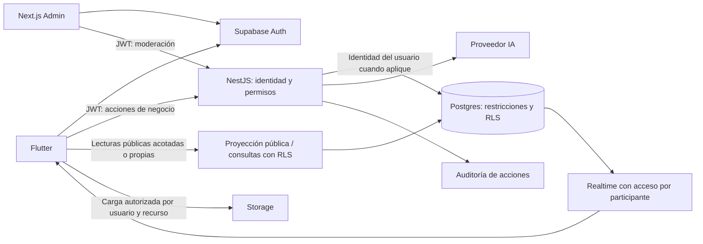
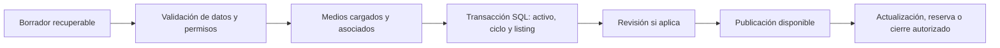

# Plan de mejora de flujos, seguridad y rendimiento de KAZA

Fecha de propuesta: 24 de septiembre de 2026. Actualización: 27 de septiembre de 2026. Estado: implementación local en curso; pendiente de ensayo en staging.

El avance, las pruebas y los pendientes se registran en [IMPLEMENTACION_SEGURIDAD.md](IMPLEMENTACION_SEGURIDAD.md). Este documento conserva los objetivos del plan; no todos sus criterios de aceptación están completados.

## 1. Objetivo y alcance

Consolidar un flujo confiable de exploración → contacto → seguimiento, y otro de borrador → publicación → actualización → cierre. Proteger identidades, información privada y operaciones entre organizaciones, manteniendo el stack Flutter + NestJS + Supabase + Next.js.

Base: [README](../README.md) y revisión estática de controladores, servicios, proveedores y migraciones. No se inspeccionó la configuración del Supabase remoto ni se realizaron pruebas de intrusión, carga o despliegue. Los riesgos SQL descritos corresponden a los scripts versionados; su exposición efectiva depende de qué se haya aplicado en cada entorno.

La propuesta inicial no modificaba código ejecutable ni permisos. Ahora existen cambios locales de API, clientes y migraciones; las métricas y pruebas remotas siguen siendo objetivos, no resultados alcanzados.

**Orden recomendado:** contener riesgos → reproducir la base → establecer permisos → unificar escrituras → mejorar la experiencia → medir y optimizar → habilitar un piloto.

Para el prehackatón, priorizar entrevistas y una demo aislada. El resultado de la validación decidirá si el siguiente flujo a desarrollar es seguimiento CRM, búsqueda u otro; los controles básicos de seguridad son necesarios en cualquiera de esos casos.

## 2. Riesgos y prioridades

P0: bloquea un piloto con datos reales. P1: necesario para completar el flujo principal de forma confiable. P2: mejora posterior guiada por mediciones.

| ID | Prioridad | Evidencia local | Acción y resultado esperado |
| --- | --- | --- | --- |
| SEG-01 | P0 | `backend/src/domain/*/*.controller.ts` recibe `x-user-id`; adaptador de identidad devuelve un usuario ficticio. | Validar JWT y derivar identidad del token; rechazar suplantación. |
| SEG-02 | P0 | `00006_profiles_and_public_rpc.sql` abre lecturas/escrituras; `00007_saved_properties.sql` permite acceso general a favoritos. | Matriz de permisos, privilegios mínimos y aislamiento por usuario/organización. |
| SEG-03 | P0 | RPC de perfiles admite `p_system_role`; `fn_upgrade_subscription` modifica el plan para pruebas. | Separar campos editables de roles, planes y confianza; retirar RPC de pruebas en entornos reales. |
| SEG-04 | P0 | Admin consulta y modifica Supabase desde `page.tsx` sin una API administrativa protegida. | Sesión administrativa, autorización por acción y auditoría del servidor. |
| SEG-05 | P0 | Cliente de IA incorpora clave Gemini; backend usa `service_role`. | IA en servidor, gestión de secretos y uso acotado de privilegios elevados. |
| DAT-01 | P0 | Migraciones con doble `00015`, dependencias `u08` y funciones/tablas ausentes. | Base reproducible y actualización ensayada sin pérdida de datos. |
| FLU-01 | P1 | Flutter inserta `properties`; NestJS crea `properties`, `market_cycles` y `listings`. | Un solo contrato comercial y un único camino autorizado de publicación. |
| FLU-02 | P0 | Respuestas de éxito de demostración ante fallos; operaciones compuestas independientes. | Errores reales, transacciones e idempotencia. |
| FLU-03 | P1 | Chat y FinTech mezclan identidad/datos ficticios con llamadas remotas. | Modo demo explícito y sesiones reales en el flujo operativo. |
| REN-01 | P2 | Mapa consulta `properties.select('*')`. | Consulta por zona, proyección pública, paginación e índices medidos. |

## 3. Arquitectura objetivo

Mantener el monolito modular NestJS. No introducir microservicios ni una infraestructura de colas hasta que una tarea concreta lo justifique.

### Límites de responsabilidad

- **Flutter y admin:** presentación, validación de formularios para UX y estado local. Ocultar un botón no otorga seguridad.
- **NestJS:** autorizar acciones de negocio, coordinar procesos, validar contratos y devolver errores consistentes.
- **PostgreSQL:** integridad, transacciones, restricciones y aislamiento. Una regla crítica no depende solo de la pantalla.
- **Supabase directo:** admisible para lecturas públicas acotadas, favoritos propios y recursos con RLS probado. No es necesario trasladar toda lectura a NestJS.
- **Credenciales:** usar el contexto JWT del usuario en consultas ordinarias cuando corresponda. Reservar `service_role` para operaciones internas justificadas; nunca derivar el actor autorizado de un campo del body.

El rol `service_role` puede evitar RLS; centralizar operaciones sin verificar permisos seguiría siendo inseguro. Referencia: [seguridad de datos de Supabase](https://supabase.com/docs/guides/database/secure-data).

## 4. Etapa 0: contención y demo controlada

**Prioridad P0. Estimación: 1-2 días-persona. Responsable: backend/plataforma con apoyo frontend.**

1. Separar configuraciones y proyectos de desarrollo, demo y producción. La demo usa usuarios y datos ficticios en una base independiente; un parámetro enviado por el cliente no puede activar modo demo en el servidor real.
2. Hacer explícito el modo de demostración. Desactivar en el entorno real FinTech simulado, seeds ejecutables por usuarios y activaciones gratuitas de planes/promociones.
3. Eliminar identidades predeterminadas como alternativa a una sesión válida. En producción, abortar el arranque si faltan variables obligatorias.
4. Inventariar accesos, claves, políticas y despliegues. Rotar secretos si se confirma que fueron incluidos en bundles o expuestos; las claves públicas Supabase no se tratan como secretos.
5. Si hay una instancia pública con estos permisos y datos reales, restringir temporalmente operaciones sensibles hasta completar SEG-01 a SEG-04. La demo del prehackatón debe permanecer en su entorno aislado.

**Aceptación:** no hay acceso de demo a datos reales; ningún error remoto se convierte automáticamente en una operación financiera exitosa; las interfaces muestran claramente qué es simulado.

## 5. Etapa 1: esquema reproducible, identidad y permisos

**Prioridad P0. Estimación: 5-8 días-persona. Responsables: backend y base de datos. Depende de etapa 0.**

### 5.1 Migraciones y reconciliación

- Comparar el esquema remoto, cuando esté disponible, con las migraciones; registrar diferencias sin copiar datos personales al repositorio.
- Inventariar tablas, sobrecargas de RPC, grants, políticas, triggers y funciones de prueba. Revisar también permisos heredados de `PUBLIC` y privilegios por defecto.
- Crear una ruta reproducible de instalación limpia y una ruta incremental para bases existentes. No renombrar migraciones aplicadas sin reconciliar su historial; preferir nuevas migraciones correctivas.
- Resolver `fn_insert_property_geography`, `organization_invitations` y `fn_accept_invitation_by_code`: implementarlas con permisos explícitos o retirar sus consumidores hasta disponer de ellas.
- Ordenar dependencias de desarrolladoras y separar seeds. Ensayar respaldo y restauración en un entorno de prueba.

### 5.2 Autenticación y autorización

- Implementar guard global con excepciones públicas explícitas. Verificar firma, expiración, emisor y audiencia del JWT según la configuración del proyecto, con biblioteca/SDK compatible con la versión instalada.
- Eliminar `x-user-id` como fuente de identidad. Construir el actor desde el token verificado y comprobar estado de cuenta y membresía para acciones sensibles.
- Autorizar por recurso: usuario + acción + workspace + propiedad del recurso. No confiar en el workspace elegido en Flutter ni en roles enviados por el cliente.
- Validar roles de sistema desde datos administrados por el servidor; evitar campos de metadata editables por el usuario. Las membresías revocadas deben bloquear nuevas acciones aunque el JWT aún sea válido.
- Separar acceso administrativo del profesional. Exigir MFA para cuentas administrativas antes del piloto y comprobar el nivel de autenticación en operaciones privilegiadas.

Referencia de verificación: [JWT en Supabase](https://supabase.com/docs/guides/auth/jwts). La disponibilidad exacta del método de SDK se comprobará al implementar; no asumir que la dependencia actual incluye todas las APIs recientes.

### 5.3 Política de acceso mínima propuesta

| Recurso | Anónimo | Usuario | Miembro de organización | Administrador del sistema |
| --- | --- | --- | --- | --- |
| Publicación disponible | Solo campos públicos | Igual | Igual | Consulta y moderación autorizadas |
| Borrador / datos internos | Sin acceso | Propios | Según permiso y workspace | Acceso motivado y auditado |
| Perfil privado / favoritos | Sin acceso | Solo propios y campos editables | Sin acceso adicional automático | Solo alcance de soporte autorizado |
| Contactos CRM / oportunidades | Sin acceso | Ámbito personal autorizado | Solo organización y permiso | Sin acceso global por defecto |
| Mensajes / visitas | Sin acceso | Solo participantes | Solo si es participante o tiene asignación autorizada | Excepción de soporte explícita y auditada |
| Roles / planes / confianza | Sin escritura | Sin escritura directa | Sin escritura directa | Acciones específicas; no edición arbitraria |
| Casos de moderación | Sin acceso | Solo su reporte si se ofrece esa función | Sin acceso general | Según rol administrativo |

### 5.4 RLS, RPC y privacidad

- Sustituir políticas amplias; añadir una política restrictiva sin retirar las permisivas puede dejar acceso abierto. Probar el conjunto efectivo de grants y políticas.
- Usar `USING` y `WITH CHECK` según operación para impedir cambios de dueño o workspace. Restringir también columnas: ser dueño del perfil no autoriza cambiar rol, plan o verificación.
- Revisar cada `SECURITY DEFINER`: justificar su uso, limitar `EXECUTE`, fijar `search_path`, calificar objetos por esquema y verificar actor/recurso internamente. Preferir `SECURITY INVOKER` cuando sea suficiente.
- Separar dirección exacta, coordenadas canónicas, contacto privado y datos públicos. Una consulta pública no debe devolver columnas sensibles y esperar que la UI las oculte.
- Para la proyección pública, elegir API con DTO limitado o un mecanismo SQL con permisos explícitos. Si se usan vistas, verificar sus privilegios y RLS; `security_invoker` no sustituye permisos de columnas ni resuelve por sí solo la separación de datos privados.
- Proteger Storage por propietario/workspace, tipo y tamaño; los documentos privados no comparten bucket público con fotos publicables. Eliminar metadatos de ubicación de fotos cuando puedan revelar una dirección protegida.

Referencias: [RLS](https://supabase.com/docs/guides/database/postgres/row-level-security), [funciones y privilegios](https://supabase.com/docs/guides/database/functions).

**Aceptación:** una base vacía se inicializa; usuario A no lee ni modifica recursos de B por API, SDK, RPC, Storage o Realtime; nadie puede autoasignarse rol/plan; un usuario normal no modera contenido; se conserva la lectura pública prevista.

## 6. Etapa 2: publicación y moderación consistentes

**Prioridad P1, con corrección P0 de éxitos falsos. Estimación: 5-8 días-persona. Responsables: backend, SQL y Flutter/admin. Depende de etapa 1.**

### Modelo canónico propuesto

Mantener `properties` para el activo físico, `market_cycles` para el episodio comercial y `listings` para precio, publicación y estado comercial. Documentar qué datos son privados, públicos y compartidos entre publicaciones.

1. Inventariar propiedades sin listing, dueños faltantes y conflictos de estados/precios. No fusionar inmuebles solo por cercanía geográfica.
2. Preparar migración aditiva, con correspondencia trazable entre registros antiguos y nuevos. No inventar propietarios para completar referencias.
3. Definir un mapeo de estados revisado: por ejemplo, `PUBLISHED` podría corresponder a `AVAILABLE` tras validar vigencia; `BANNED` requiere conservar la razón de moderación y no convertirlo automáticamente en disponible.
4. Migrar en lotes idempotentes; conciliar conteos, referencias y precios. Mantener lectura compatible durante la transición y cambiar los consumidores de manera coordinada.
5. Retirar el camino de escritura antiguo después de verificar ambos clientes. No mantener indefinidamente escritura dual ni dos fuentes de precio.

### Nuevo flujo de publicación

- API propuesta: crear/editar borrador, finalizar publicación y cambiar estado. Cada comando recibe DTO acotado y el servidor determina actor y pertenencia.
- Una única transacción SQL para escrituras relacionales relacionadas. No asumir que varias llamadas al SDK comparten transacción.
- Idempotencia por actor + operación + clave, con hash de la solicitud: mismo intento devuelve el mismo resultado; reutilizar clave con datos distintos produce conflicto.
- Medios y SQL no comparten transacción: usar cargas pendientes, asociación al confirmar y limpieza posterior de archivos huérfanos. Conservar el borrador si falla la carga.
- Transiciones comerciales explícitas, validación de estado previo y control de versión/bloqueo para cambios concurrentes. Separar moderación, ciclo comercial y promoción.
- Transferencia de controlador mediante solicitud, aceptación por destinatario autorizado, vencimiento y auditoría, sin reiniciar el ciclo ni la fecha comercial.
- Respuestas con código, mensaje accionable y `requestId`; no retornar éxito si falló la persistencia. No filtrar SQL o secretos en el error.
- Moderación mediante API protegida, motivo obligatorio y evento de auditoría. Preferir suspensión recuperable frente a borrado irreversible en la operación diaria.

**Aceptación:** un doble clic o reintento crea una sola publicación; un fallo inducido no deja registros comerciales parciales; el borrador se recupera; cambios concurrentes no sobrescriben silenciosamente; mapa, detalle y admin muestran el mismo estado persistido.

## 7. Etapa 3: mejorar el recorrido de usuarios y agentes

**Prioridad P1. Estimación: 4-6 días-persona. Responsable: Flutter, con apoyo backend/admin. Depende del contrato de etapa 2.**

| Recorrido | Mejora propuesta | Evidencia de aceptación |
| --- | --- | --- |
| Explorar → detalle | Mantener zona y filtros al volver; estados claros de carga, vacío, error y datos incompletos. | No se pierde la búsqueda al abrir/cerrar detalle. |
| Guardar/contactar → login | Pedir sesión al realizar la acción; después continuar la intención original una sola vez. | No se pierde el inmueble ni se duplica la acción tras iniciar sesión. |
| Publicar | Pasos breves: datos, ubicación, medios y revisión; autoguardado autorizado, progreso de carga y reintento. | Cerrar/reabrir recupera el borrador propio; fallo de red no afirma publicación. |
| Contacto → seguimiento | Conversación vinculada a listing y participantes; siguiente acción y fecha si CRM resulta prioritario. | Consulta queda asociada al inmueble correcto y solo sus participantes la reciben. |
| Organización | Mostrar workspace activo y permisos; limpiar caché/estado al cambiar organización o cerrar sesión. | No aparecen datos del workspace anterior ni acciones sin permiso. |
| Admin | Filtros persistentes, detalle antes de actuar y confirmación para acciones sensibles. | Fallo del servidor restaura el estado visual; no aparenta una moderación exitosa. |

Extraer acceso a datos hacia repositorios/servicios por funcionalidad, comenzando por publicación, sesión y mapa. No reescribir todas las pantallas a la vez. Unificar el cliente HTTP, URL de API por entorno, manejo de sesión expirada y errores.

En chat, reemplazar usuarios y conversaciones ficticias; esperar la confirmación de envío, mostrar pendiente/fallido, deduplicar por ID y liberar suscripciones al salir. El filtro de un canal reduce tráfico, pero la autorización debe impedir que un usuario se suscriba a una conversación ajena.

Configurar la recarga por nueva versión del admin para no interrumpir un formulario o una operación pendiente.

## 8. Etapa 4: rendimiento y resiliencia medidos

**Prioridad P2. Estimación: 3-5 días-persona. Responsables: frontend y base de datos. Depende de contratos y permisos estables.**

1. Establecer línea base con dispositivo, red, volumen de inventario y concurrencia definidos. Medir p50/p95, tamaño de respuesta, número de solicitudes y tiempos SQL antes de optimizar.
2. Sustituir cargas completas del mapa por consultas según área visible, filtros y límite. Debounce inicial de 300 ms al desplazar el mapa; cancelar/ignorar respuestas antiguas.
3. Proyectar solo campos necesarios para pines/tarjetas y cargar detalle al abrir. Limitar resultados; usar agrupación a zoom bajo y paginación estable para listas.
4. Evaluar consultas PostGIS e índices con planes reales. Indexar relaciones de workspace, estado y ordenación según filtros comprobados; no añadir índices indiscriminadamente.
5. Miniaturas y versiones de imagen adecuadas a pantalla; carga diferida de tours. Cachear solo contenido público o contenido privado con clave de usuario/workspace y limpieza al cerrar sesión.
6. Invalidación puntual después de publicar, guardar o cambiar estado. Evitar recargar todo el catálogo ante cada evento Realtime.
7. Límites por usuario/IP y operación; cuotas y timeouts para IA, búsquedas, cargas y mensajes. Reintentos acotados con backoff solo para operaciones seguras o idempotentes.
8. Llevar IA al servidor con cuotas, contexto mínimo autorizado y sin claves en bundles. Tratar anuncios y mensajes como datos no confiables; el modelo no puede conceder permisos ni ejecutar escrituras sin autorización independiente.

### Objetivos iniciales propuestos, no resultados actuales

| Métrica | Objetivo para un piloto controlado |
| --- | --- |
| Consulta pública por zona | p95 ≤ 800 ms con 10.000 listings y 20 usuarios concurrentes en staging. |
| Primera vista útil del mapa | ≤ 2,5 s en dispositivo de referencia y perfil 4G documentado. |
| Respuesta de catálogo | Hasta 100 elementos por petición y objetivo ≤ 150 KB de JSON sin imágenes. |
| Publicación tras terminar cargas | p95 ≤ 2 s en staging para el comando transaccional. |
| Reintentos duplicados | Cero publicaciones duplicadas en prueba de idempotencia. |
| Seguridad funcional | Cero accesos indebidos en la matriz de pruebas; no implica ausencia total de vulnerabilidades. |

Ajustar objetivos a la línea base y presupuesto antes del piloto; no relajar seguridad para alcanzar una cifra de latencia. La prueba de carga se ejecuta en un entorno propio de staging.

## 9. Etapa 5: liberación y operación

**Prioridad P1 para piloto. Estimación: 2-4 días-persona. Responsable: plataforma/QA. Preparación desde etapa 1.**

- CI: análisis Flutter, compilación de clientes/backend y pruebas focalizadas de autorización, SQL y flujos críticos. Fijar runtimes y usar lockfiles.
- Auditoría de dependencias y secretos, con revisión de hallazgos antes de actualizar versiones. No hacer una actualización masiva sin comprobar compatibilidad.
- Configuración validada, HTTPS, orígenes CORS permitidos y política de cookies/CSRF si se usan sesiones por cookie. CORS no reemplaza autenticación ni bloquea clientes fuera del navegador.
- Separar liveness del proceso y readiness con una comprobación mínima de dependencias. Logs estructurados con requestId, actor y recurso; omitir tokens, documentos y contenido privado de mensajes.
- Registrar acciones administrativas y cambios sensibles en un registro que el cliente no pueda editar. Definir retención y acceso.
- Alertas de errores, fallos de autenticación anómalos, costes de IA y cargas. Límites iniciales calibrados con uso real.
- Ensayar el runtime elegido para NestJS: servidor persistente o entrada serverless compatible. Comprobar enlaces directos en Flutter web y variables de cada build.
- Respaldos y ensayo de restauración, despliegue gradual y rollback de aplicación compatible con el nuevo esquema. No revertir automáticamente políticas seguras a políticas abiertas para resolver una regresión.

**Aceptación:** deploy y restauración ensayados en staging; logs explican un fallo sin exponer secretos; no hay P0 abierto; los caminos críticos y negativos pasan antes de invitar usuarios reales.

## 10. Pruebas obligatorias del piloto

| Caso | Resultado esperado |
| --- | --- |
| Token ausente, expirado o de emisor incorrecto | 401 en operación protegida; ningún cambio. |
| Usuario A envía `x-user-id` de B | Cabecera ignorada como identidad; no obtiene acceso de B. |
| Cambiar IDs en body, URL, RPC o filtros SDK | Denegación o ausencia de filas ajenas; no filtración de datos. |
| Autoeditar rol, membresía, plan o confianza | Rechazo por API y por acceso directo SQL/RPC. |
| Acceder a favoritos/perfil privado ajenos | Sin acceso, aun con cliente modificado. |
| Miembro expulsado con JWT todavía vigente | Bloqueo de nuevas operaciones organizativas y control del acceso Realtime. |
| Fotos/documentos de otro workspace | Carga, lectura privada y borrado rechazados. |
| Suscripción a conversación ajena | Ningún evento ni historial recibido. |
| Falla SQL durante publicación | Rollback relacional y error visible; borrador recuperable. |
| Repetir comando con igual clave / diferente payload | Resultado estable / conflicto respectivamente. |
| Dos operadores cambian estado a la vez | Conflicto controlado o serialización; sin pérdida silenciosa. |
| Pérdida de conexión durante envío | Estado pendiente/fallido; reintento no duplica. |
| Error FinTech o IA | Error explícito; nunca una transacción real inventada. |
| Consulta pública | Solo estado/campos públicos; sin dirección privada ni contactos internos. |
| Migración desde vacío y desde copia de esquema previo | Integridad y permisos verificados en ambos caminos. |

## 11. Secuencia de entregas revisables

| Entrega | Contenido | Dependencia |
| --- | --- | --- |
| 1 | Separación demo/entornos, validación de configuración y retirada de éxitos ficticios. | Ninguna |
| 2 | Migraciones reproducibles, inventario de permisos y fixtures de usuarios A/B y organizaciones. | 1 |
| 3 | JWT, matriz de autorización, RLS/RPC endurecidos y API admin protegida; adaptar clientes a estos contratos. | 2 |
| 4 | Modelo comercial canónico, migración compatible, publicación transaccional y manejo de medios. | 3 |
| 5 | Flutter/admin consumen publicación y estados nuevos; retirar escrituras antiguas. | 4 |
| 6 | Sesión progresiva, borradores, chat privado y seguimiento del flujo priorizado por entrevistas. | 3 y 5 |
| 7 | Mapa acotado, imágenes, métricas y límites de consumo. | 5 |
| 8 | CI completa, operación, restauración y checklist de salida a piloto. | Todas las necesarias para el alcance del piloto |

Estimación total orientativa: **20-33 días-persona** para las etapas descritas, sin integración bancaria, cobros reales ni rediseño completo. No equivale a días calendario: depende del equipo, la calidad de los datos y las diferencias del entorno remoto. Reestimar al finalizar etapa 1.

Para el próximo prehackatón, limitar el cambio a etapa 0 y al recorrido de demostración ensayado; no intentar migrar todo el sistema justo antes de entrevistar. Para un piloto real, completar etapas 1, 2 y 5, más la parte de etapa 3 necesaria para el flujo seleccionado. Etapa 4 puede incorporarse según la carga medida.

## 12. Decisiones iniciales y límites

Supuestos propuestos: NestJS continúa como monolito; el modelo comercial normalizado es la fuente objetivo; la navegación pública sigue abierta; el pagador y las funciones comerciales se ajustan después de las entrevistas.

Antes de implementar migraciones, confirmar versión/esquema remoto, existencia de datos reales y entornos disponibles. Antes del piloto, elegir responsables de moderación y soporte, flujo de publicación con o sin revisión previa, campos que podrán ser públicos y criterios de retención.

Quedan fuera: wallet con dinero real, KYC bancario real, cobros sin verificación del proveedor, sistemas nuevos de blockchain, microservicios y optimización sin mediciones. Si se priorizan pagos más adelante, requieren un plan propio de comprobantes/webhooks verificados, idempotencia, conciliación y registro contable; no basta con endurecer el mock.

**Primer paso implementable:** preparar la separación demo/real y las pruebas de identidad y permisos, antes de cambiar el flujo de publicación.
